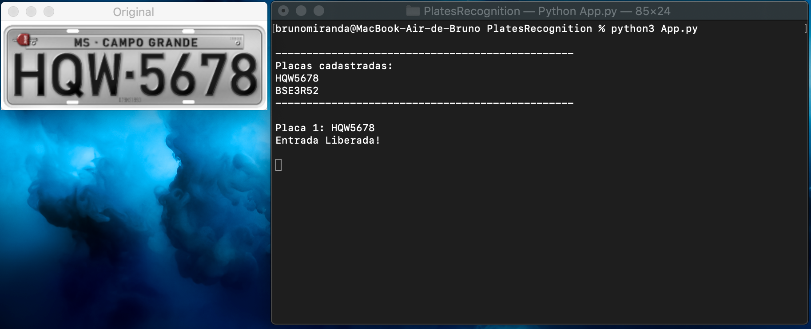
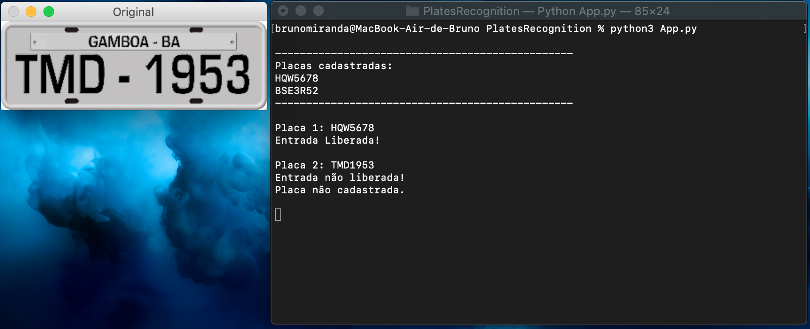
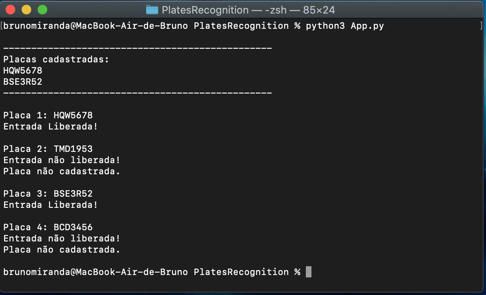

## License Plates Identification

This is a Python application based on OpenCV and PyTesseract that identifies license plates (brazilian plates).
The app compares the identified plate with the registered ones in a list ("Placas cadastradas"). If it is registered in the list, the correct output will be given in the terminal ("Entrada Liberada!").
The plate image is showed for reference at each iteration.

Registered plate example:

Unregistered plate example:

All the outputs:

